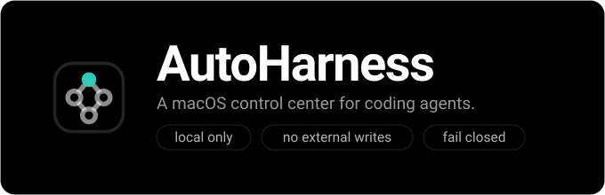
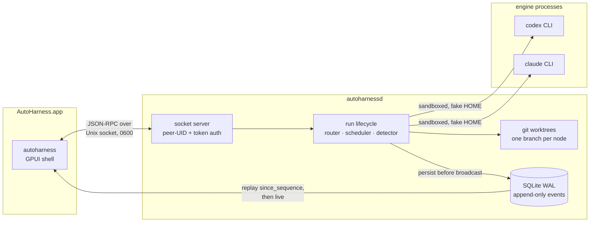
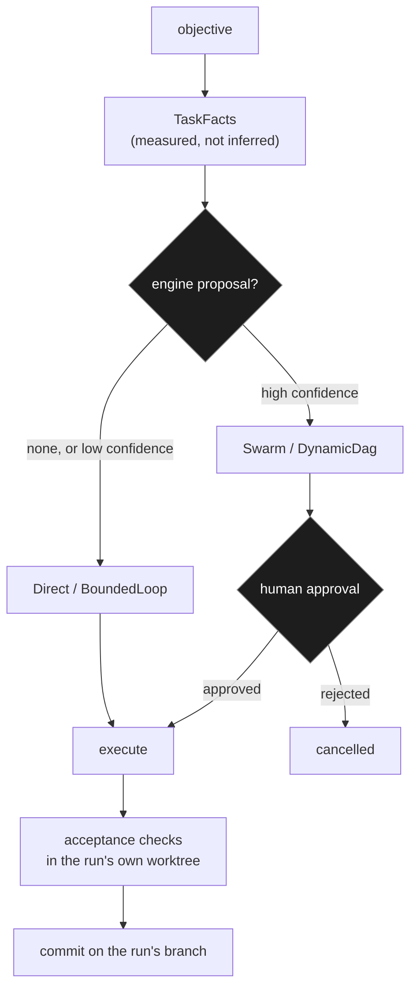
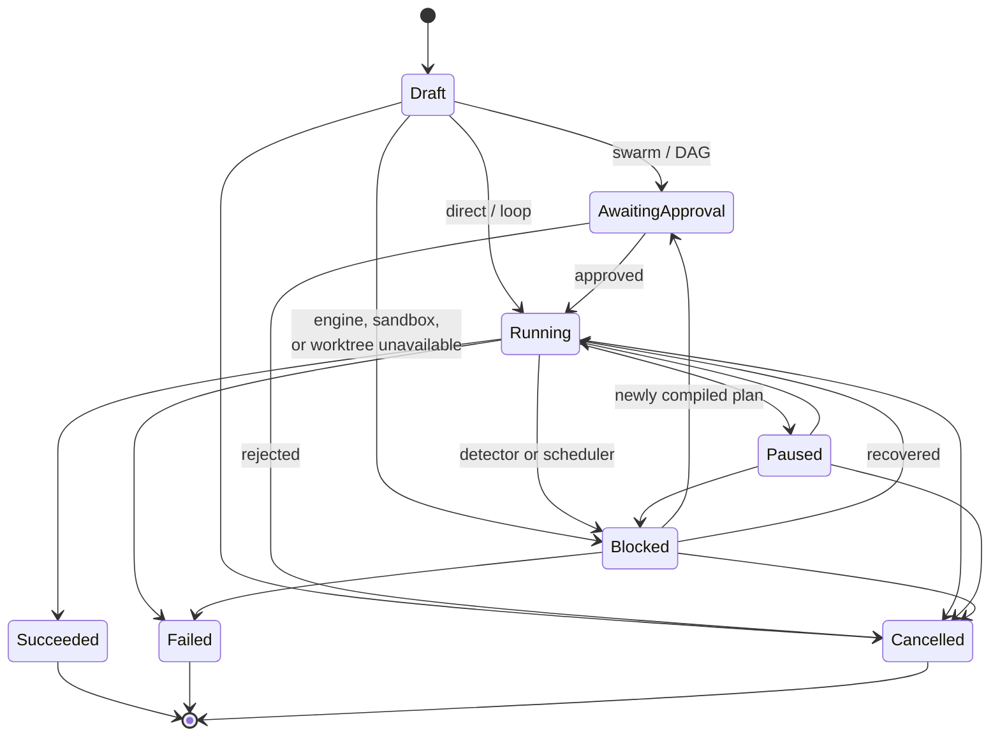
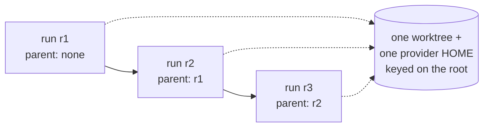

# AutoHarness

[](#requirements)
[](#requirements)
[](Cargo.toml)
[](LICENSE)
[](#test)
[](SECURITY.md)

> Badges are declared facts, not CI output. There is no hosted pipeline: the
> GPUI shell needs a Metal toolchain, so the gate in
> [CONTRIBUTING.md](CONTRIBUTING.md) runs locally and is what those numbers
> come from.

A macOS-only coding-agent control center. Accepts one objective through
coordinator chat, routes it to direct execution, a bounded loop, a swarm, or
a dynamic DAG, and orchestrates installed Codex or Claude CLI sessions — all
local, no external writes. See `PLAN.md` for the full product plan, and
[docs/ARCHITECTURE.md](docs/ARCHITECTURE.md) for how the pieces fit.

**Status: all local V1 phases are complete in code.** Foundation, engine
bridge, sandbox, durable queues, direct chat, router and loops, graphs and
swarms, replayable review surfaces, memory/evolution, the true-black cockpit,
and release hardening ship together. Release hardening covers data integrity,
export, privacy purge, diagnostics, semantic keyboard/VoiceOver accessibility,
native attention, universal packaging, and a fail-closed signed-update path.
Production signing, notarization, and update-feed hosting still require the
owner's external credentials. A raw interactive PTY is intentionally outside
AutoHarness's structured-agent scope; captured ANSI check output and classified
unified diffs are built in.

## Documentation

| Document | What it covers |
| --- | --- |
| [docs/ARCHITECTURE.md](docs/ARCHITECTURE.md) | Process split, ledger ordering, router bias, thread model, sandbox layers |
| [SECURITY.md](SECURITY.md) | Threat model, confinement boundaries, fail-closed rules, your data |
| [CONTRIBUTING.md](CONTRIBUTING.md) | Setup, the four-step gate, what must not be weakened |
| [PLAN.md](PLAN.md) | The full product plan this was built against |
| [docs/reference/COCKPIT.md](docs/reference/COCKPIT.md) | Visual acceptance criteria for the shell |
| [docs/STATUS.md](docs/STATUS.md) | Phase-by-phase completion state |

## Requirements

- macOS 14+
- Rust 1.97+ (edition 2024)
- Xcode, plus the Metal toolchain for the GPUI shell:
  `xcodebuild -downloadComponent MetalToolchain`

## Build

```sh
cargo build --workspace
```

## Run

Daemon (Unix socket under `~/Library/Application Support/dev.autoharness.app/`,
mode 0600, peer-UID check, Keychain-held client token):

```sh
cargo run -p autoharnessd
```

Desktop shell (GPUI). It starts the daemon if it
is not already running, replays the ledger, then streams live:

```sh
cargo run -p autoharness
```

AutoHarness reuses the Codex and Claude logins already on the machine — there
is no second sign-in. The projects pane shows each engine's state, and names
the CLI's own command (`codex login`, `claude auth login`) if one needs it.
The composer exposes a native macOS repository picker plus a capability-backed
model/reasoning chooser. Codex choices come from its token-free `model/list`
control call; Claude choices use the aliases and effort levels supported by the
installed CLI. The exact selection is persisted on the queued run and reused
by planning, direct execution, resume, and every graph node.

The input line takes an objective, or a slash command. The `+` and repository
breadcrumb open the native folder chooser; choosing any folder inside a Git
repository resolves to its canonical root. `/add <path>` provides the same
validated path in text form, `/p <n>` selects one, `/engine codex|claude` picks the engine,
`/check <cmd>` sets the verification command, `/approve` accepts a proposed
plan, `/open` opens the run's worktree, and `/pause`, `/resume`, `/cancel`,
`/i <text>` control a live run. While a run is live, plain text steers it at
the next turn boundary.

## Test

```sh
cargo test --workspace
```

Live tests that drive the real Codex/Claude CLIs spend tokens and are gated:

```sh
AUTOHARNESS_LIVE_TESTS=1 cargo test -p autoharness-daemon --test live_direct_run
```

## Package

```sh
./scripts/package.sh                                   # unsigned, local only
SIGN_IDENTITY="Developer ID Application: ..." \
NOTARY_PROFILE=autoharness \
RELEASE_TEAM_ID=YOURTEAMID \
RELEASE_FEED_URL=https://releases.example.com/stable/appcast.json \
  ./scripts/package.sh                                 # signed + notarized + updater enabled
```

The release script ships the daemon and independent update helper inside the
universal app, notarizes and staples it, and emits a SHA-256-pinned feed record.
Unsigned builds or builds without the compile-time Team ID and HTTPS feed URL
remain fully usable but deliberately expose no self-install action.

## Your data

Everything lives under `~/Library/Application Support/dev.autoharness.app/`.
`app.export` returns the whole database as JSON, and `app.purge_project`
erases a project and everything derived from it, irreversibly.

## Architecture

Three processes. The shell never touches SQLite or an engine directly — it
speaks JSON-RPC to the daemon, which owns every side effect.



One objective becomes one run. The router decides the shape from measured
facts; an engine may propose something richer, and Rust decides whether to
believe it.



Uncertainty falls **down** the ladder, never up: a low-confidence proposal
becomes a bounded loop, because a graph nobody validated commits several
workers to a plan nobody validated. `Swarm` and `DynamicDag` additionally
require a human to approve.

Run states are an explicit table — an illegal transition is a `Result::Err`,
never a panic.



A follow-up is a **new run** with a `parent_run_id`, not a new conversation.
Every turn of one thread shares one worktree and one provider home, which is
what lets the provider resume the transcript it wrote last turn.



The sidebar lists thread **roots**; the transcript walks the chain downward
so every turn of a conversation reads as one conversation.

```
crates/core       autoharness-core      domain types, run/node state machines, routing contracts
crates/protocol   autoharness-protocol  versioned JSON-RPC 2.0 envelopes, length-delimited framing
crates/store      autoharness-store     SQLite (WAL) ledger, migrations, snapshots, replay
crates/engines    autoharness-engines   EngineAdapter contract, normalized events, Fake/Codex/Claude adapters
crates/daemon     autoharness-daemon    socket server, auth, RPC dispatch, run lifecycle, worktrees, sandbox, event persistence/replay
crates/ui-gpui    autoharness-ui-gpui   GPUI shell, design tokens, daemon client
bins/autoharness  autoharness           desktop binary
bins/autoharnessd autoharnessd          daemon binary
bins/updater      autoharness-updater   authenticated atomic update swap, rollback, and relaunch helper
```

Key contracts (enforced in code and tests):

- **Persist before broadcast.** Every event is written to the SQLite
  append-only ledger before it is broadcast to subscribers. Reconnecting
  clients call `events.subscribe` with `since_sequence` and receive replay
  followed by live events.
- **Illegal transitions are errors, not panics.** Run and node state
  machines are explicit functions returning `Result`.
- **Versioned protocol.** All envelopes carry `protocol_version`; events
  also carry a monotonic `sequence`, `run_id`, timestamp, type, payload.
- **Isolated by construction.** Every editing run gets its own git worktree
  and branch; the user's checked-out branch is never touched, and a worktree is
  reclaimed only when it is clean and commit-free.
- **Execution choices are run data.** Provider, model, and reasoning effort
  are validated, persisted, replayable fields — never transient UI state — and
  queued runs cannot silently inherit a later selector change.
- **Fail closed.** No sandbox, no proxy, or a failed canary means `run.start`
  is refused with structured diagnostics — never an unsandboxed fallback.
- **Local only.** No external writes (push/PR/deploy) anywhere in V1.
